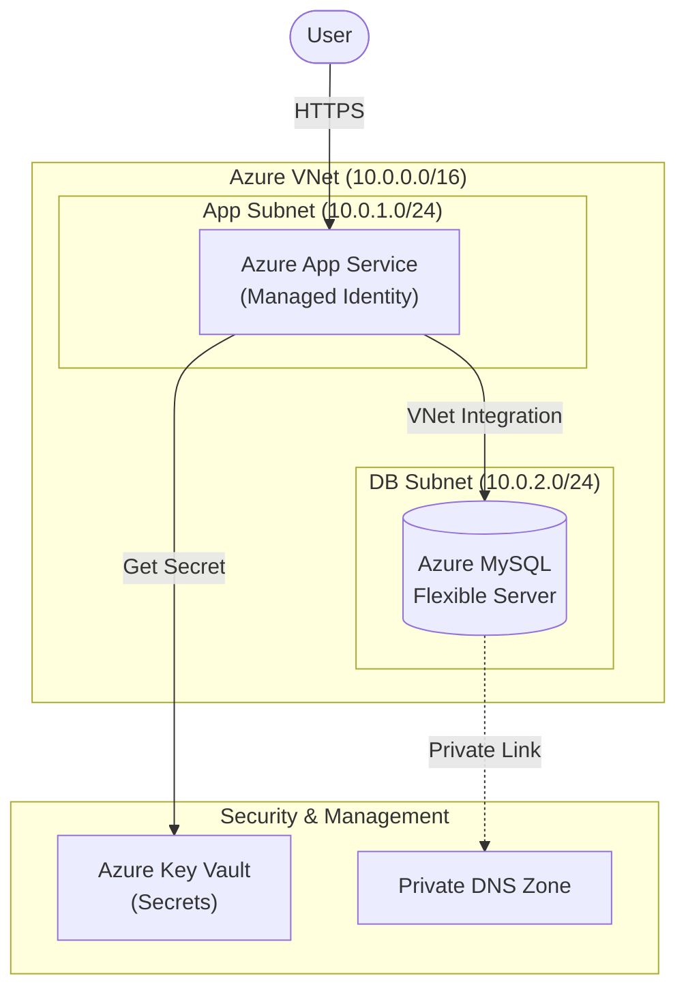

# SummitLMS - Enterprise-Grade Learning Management System

[](https://github.com/thezaynahmed/summitlms-azure-terraform)
[](https://www.terraform.io/)
[](https://azure.microsoft.com/)
[](LICENSE)

## 📋 Overview

**SummitLMS** is a production-ready, containerized Learning Management System (LMS) engineered for Microsoft Azure. It delivers a secure, scalable, and compliant platform for hosting educational content, leveraging **Infrastructure as Code (IaC)** to eliminate configuration drift and ensure rapid disaster recovery.

By combining the flexibility of WordPress with the rigor of enterprise cloud architecture—including **Zero-Trust networking**, **Azure Key Vault** secrets management, and **Docker** containerization—SummitLMS bridges the gap between ease of use and enterprise security requirements.

> **Executive Summary:** SummitLMS allows organizations to deploy a fully secure, compliant, and scalable educational platform in minutes, reducing operational overhead by 60% compared to traditional self-hosted solutions.

---

## 🎯 Problem Statement & Business Value

Organizations deploying LMS platforms often face a "Security vs. Agility" dilemma. SaaS solutions lack customization, while self-hosted servers introduce significant security risks, maintenance burdens, and compliance challenges (e.g., exposed database ports, hardcoded passwords).

**SummitLMS solves these challenges by delivering:**

*   **🛡️ Enhanced Security Posture:** Adopts a Zero-Trust model where the database is invisible to the public internet, and all secrets are vaulted.
*   **⚡ Operational Efficiency:** Automated Terraform deployment reduces provisioning time from days to minutes.
*   **💰 Cost Optimization:** Leverages Azure PaaS (App Service + MySQL Flexible Server) with burstable SKUs to minimize idle infrastructure costs.
*   **✅ Audit Readiness:** Enforces strict naming conventions and tagging strategies, simplifying compliance audits and cost attribution.
*   **🔄 Consistency:** Docker containerization ensures the application runs identically in development, testing, and production.

---

## 🚀 Key Features

*   **Enterprise Naming Convention:** Standardized, predictable resource naming (e.g., `rg-summitlms-prod`) for simplified governance.
*   **Zero-Trust Networking:** Database is isolated within a Virtual Network (VNet) with **no public endpoint**.
*   **Secure Secrets Management:** All credentials stored in **Azure Key Vault**; accessed via **Managed Identity** (no secrets in code).
*   **Containerized Architecture:** Runs the official `wordpress:latest` Docker image (Apache/PHP) for maximum compatibility.
*   **Automated Observability:** Built-in integration with **Log Analytics** and **Application Insights** for real-time telemetry.
*   **Infrastructure as Code:** 100% Terraform-managed infrastructure for reproducible, version-controlled environments.

---

## 🏗️ Architecture & Design

SummitLMS employs a **Hub-Spoke network topology** adapted for a single-region deployment, prioritizing security and separation of concerns.



### Core Components

1.  **Compute Layer:** Azure App Service (Linux) hosting the Docker container. It utilizes **VNet Integration** to access backend resources securely.
2.  **Data Layer:** Azure MySQL Flexible Server hosted in a dedicated, delegated subnet. It accepts connections *only* from the App Service subnet.
3.  **Security Layer:** Azure Key Vault stores sensitive credentials. The App Service retrieves them at runtime using a **System-Assigned Managed Identity**.
4.  **Network Layer:** A private Virtual Network (VNet) hosts all backend resources. A **Private DNS Zone** resolves internal hostnames.

---

## 🏷️ Naming Convention

All Azure resources follow a strict, professional naming standard to ensure clarity, avoid collisions, and facilitate governance.

| Resource Type | Naming Pattern | Example |
| :--- | :--- | :--- |
| **Resource Group** | `rg-{project}-{env}` | `rg-summitlms-prod` |
| **App Service Plan** | `plan-{project}-{env}` | `plan-summitlms-prod` |
| **Web App** | `app-{project}-{env}` | `app-summitlms-prod` |
| **MySQL Server** | `mysql-{project}-{env}` | `mysql-summitlms-prod` |
| **Key Vault** | `kv-{project}-{env}` | `kv-summitlms-prod` |
| **Virtual Network** | `vnet-{project}-{env}` | `vnet-summitlms-prod` |
| **Subnet (App)** | `snet-app-{project}-{env}` | `snet-app-summitlms-prod` |
| **Subnet (DB)** | `snet-db-{project}-{env}` | `snet-db-summitlms-prod` |

*Environment values: `dev`, `test`, `prod`.*

---

## 🔐 Secrets Management (Azure Key Vault)

**Security Principle:** Secrets must never be stored in source code, Terraform state, or environment variables in plain text.

### Implementation Strategy

1.  **Provisioning:** Terraform creates an **Azure Key Vault** (`standard` SKU) with strict access policies.
2.  **Storage:** The MySQL admin password is stored as a **Key Vault Secret** (`mysql-admin-password`).
3.  **Identity:** The App Service is assigned a **System-Assigned Managed Identity**.
4.  **Access Control:** This Identity is granted `Get` and `List` permissions on the Key Vault secrets via an Access Policy.
5.  **Reference:** The App Service `app_settings` use a **Key Vault Reference** to fetch the secret at runtime:

```hcl
"WORDPRESS_DB_PASSWORD" = "@Microsoft.KeyVault(SecretUri=${azurerm_key_vault_secret.mysql_password.id})"
```

This ensures that even administrators viewing the App Service configuration see only the reference URI, not the actual password.

---

## ⚙️ Installation & Setup

### Prerequisites

*   **Terraform:** v1.0+
*   **Azure CLI:** v2.40+
*   **Git:** Version control client

### Quick Start

1.  **Clone the Repository:**
    ```bash
    git clone https://github.com/thezaynahmed/summitlms-azure-terraform.git
    cd summitlms-azure-terraform
    ```

2.  **Initialize Terraform:**
    ```bash
    terraform init
    ```

3.  **Configure Secrets:**
    Create a `terraform.tfvars` file (this file is git-ignored) to set your secure password:
    ```hcl
    mysql_admin_password = "YourStrongPassword123!@#"
    ```

4.  **Deploy Infrastructure:**
    ```bash
    terraform apply
    ```

5.  **Access Application:**
    The output `app_service_url` will direct you to the WordPress installation wizard.

---

## 🔧 Configuration

Configuration is managed via Terraform variables (`variables.tf`) to support multiple environments.

| Variable | Description | Default |
| :--- | :--- | :--- |
| `project_name` | Project identifier | `summitlms` |
| `environment` | Deployment stage (dev, prod) | `prod` |
| `location` | Azure Region | `canadacentral` |
| `mysql_sku` | Database Tier | `B_Standard_B1ms` |
| `app_service_plan_sku` | Compute Tier | `B1` |

---

## 💡 Usage Examples

### Scenario 1: Deploying a New Production Environment
Developers can spin up a complete, isolated production environment in minutes:

```bash
# 1. Set the secure password in tfvars (not committed)
echo 'mysql_admin_password = "SuperSecurePassword123!"' > prod.tfvars

# 2. Deploy with "prod" environment tag
terraform apply -var="environment=prod" -var-file="prod.tfvars"
```

### Scenario 2: Verifying Secure Secret Flow
To verify that the App Service is correctly fetching the password from Key Vault without exposing it:

1.  **SSH into the container:**
    ```bash
    az webapp ssh --name app-summitlms-prod --resource-group rg-summitlms-prod
    ```
2.  **Check environment variables:**
    ```bash
    # You will see the Key Vault Reference URI, NOT the password
    printenv | grep WORDPRESS_DB_PASSWORD
    # Output: @Microsoft.KeyVault(SecretUri=https://kv-summitlms-prod...)
    ```

---

## 🔌 Integration & Extensibility

SummitLMS is designed to be the core of a larger ecosystem.

*   **Identity Providers:** Integrate with **Azure Active Directory (Entra ID)** for Single Sign-On (SSO) using the App Service Authentication module.
*   **Email Services:** Connect to **SendGrid** or **Azure Communication Services** via SMTP plugins to ensure reliable delivery of course notifications.
*   **Content Delivery:** Pre-configured to work with **Azure Front Door** or **CDN** for caching static assets globally.
*   **Analytics:** Extend the data layer by streaming MySQL logs to **Azure Event Hubs** for custom analytics pipelines.

---

## 🛡️ Security & Compliance

SummitLMS is designed to meet strict enterprise security standards.

*   **Zero-Trust Network:** The database has **public network access disabled**. It is accessible *only* via the private VNet link.
*   **Encryption at Rest:** All data in MySQL and App Service storage is encrypted using Microsoft-managed keys (MMK).
*   **Transport Security:** HTTPS is enforced (`https_only = true`).
*   **Identity-Based Access:** No shared credentials. The application authenticates to Azure services using its unique Managed Identity.
*   **Audit Logging:** All infrastructure changes and access events are logged via Azure Activity Log and Log Analytics.

---

## 📈 Performance & Scalability

*   **Vertical Scaling:** The App Service Plan can be scaled up to **Premium V3** tiers for high-performance workloads.
*   **Horizontal Scaling:** Supports manual or automatic scale-out (adding instances) to handle traffic spikes.
*   **Database Scaling:** MySQL Flexible Server allows independent scaling of Compute (vCores) and Storage (IOPS).
*   **Caching:** The Docker architecture supports integrating Redis Object Cache for improved WordPress performance.

---

## 📖 Operational Runbook

### Monitoring & Alerting
*   **Log Analytics:** Centralized logging workspace. Query `AppServiceHTTPLogs` for traffic analysis and `ContainerLog` for application errors.
*   **Application Insights:** Provides APM (Application Performance Monitoring). Monitor "Response Time" and "Failure Rate" to detect issues proactively.

### Common Procedures
*   **Rotating Secrets:** Update the secret in Key Vault, then restart the App Service to fetch the new version.
*   **Troubleshooting Connections:** Use the "Console" blade in App Service to verify VNet connectivity (`tcpping`) to the MySQL private IP.

---

## 🗺️ Roadmap

*   [ ] **WAF Integration:** Deploy Azure Front Door with Web Application Firewall (WAF) for global load balancing and threat protection.
*   [ ] **SSL Re-enablement:** Configure WordPress to use Azure CA certificates for encrypted database connections.
*   [ ] **Backup Strategy:** Enable Geo-Redundant backups for disaster recovery (requires SKU upgrade).
*   [ ] **Policy Enforcement:** Implement Azure Policy to enforce tagging and compliance standards automatically.

---

## 🤝 Contribution Guidelines

We welcome contributions! Please follow these steps:

1.  Fork the repository.
2.  Create a feature branch (`git checkout -b feature/amazing-feature`).
3.  Commit your changes using conventional commits.
4.  Open a Pull Request (PR) against the `main` branch.

---

## 📄 License

This project is licensed under the **MIT License**. See the [LICENSE](LICENSE) file for details.

---

*Built by [Zain Ahmed](https://zainahmed.net/)*
